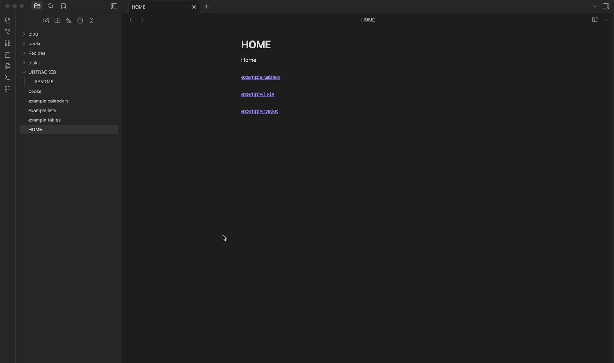

# File Case Converter

A powerful Obsidian plugin that converts file and folder names between different cases (lowercase, uppercase, capitalize) with both individual and bulk operations support.


## ✨ Features

### 🎯 **Multiple Case Formats**
- **Lowercase**: `MyFile.MD` → `myfile.md`
- **Uppercase**: `myfile.md` → `MYFILE.MD`  
- **Capitalize**: `myfile.md` → `Myfile.md`

### 🎮 **Flexible Operations**
- **Single Item**: Convert individual files or folders
- **Recursive (All)**: Convert entire folder structures including subfolders

### ⚙️ **Configurable Settings**
- Enable/disable each case type independently

### 🔒 **Safety Features**
- Confirmation dialogs for bulk operations
- Conflict detection (won't overwrite existing files)
- Detailed error reporting and console logging

## 🚀 Quick Start

### Installation (Manual)
1. Download the plugin files
2. Place in your vault's `.obsidian/plugins/file-case-converter/` folder
3. Enable the plugin in Obsidian Settings → Community Plugins

### Basic Usage

#### Right-Click Context Menu
1. Right-click on any file or folder in Obsidian's file explorer
2. Choose from available options:
   - `[Case] name` - Convert single item
   - `[Case] all` - Convert entire folder recursively

## 📋 Examples



### Individual File Conversion
```
Right-click on "MyDocument.MD"
↓ Select "Lowercase name"
Result: "mydocument.md"
```

### Folder Structure Conversion
```
Before (right-click "ProjectFolder" → "Lowercase all"):
ProjectFolder/
├── SubFolder/
│   ├── File1.TXT
│   └── File2.MD
└── AnotherFile.DOC

After:
projectfolder/
├── subfolder/
│   ├── file1.txt
│   └── file2.md
└── anotherfile.doc
```

## ⚙️ Settings

Access via **Settings → File Case Converter**

### Enable/Disable Options
- **Enable Lowercase** ✓/✗ - Show lowercase options in context menu
- **Enable Uppercase** ✓/✗ - Show uppercase options in context menu  
- **Enable Capitalize** ✓/✗ - Show capitalize options in context menu

### Smart Behavior
- Only enabled options appear in context menus
- Modal interface adapts based on enabled options
- If multiple options enabled: dropdown selection
- If single option enabled: automatic selection

## 🔧 Development

### Local Development Setup
```bash
# Clone the repository
git clone <your-repo-url>
cd file-case-converter

# Install dependencies
npm install

# Start development with watch mode
npm run dev
```

This will:
- Compile TypeScript to JavaScript
- Watch for file changes
- Auto-deploy to your test vault
- Enable hot reload

## 🛡️ Safety & Best Practices

### ⚠️ Important Warnings
- **Operations cannot be undone** - Always backup important files
- **Confirmation required** - Bulk operations show confirmation dialogs
- **Conflict handling** - Won't overwrite existing files with same name

### Development Workflow
1. Fork the repository
2. Create feature branch
3. Make changes and test thoroughly
4. Submit pull request with clear description

## 📄 License

MIT License - see LICENSE file for details

## 🙏 Acknowledgments

- Built for [Obsidian](https://obsidian.md/)
- Inspired by the excellent [Dataview plugin](https://github.com/blacksmithgu/obsidian-dataview) development workflow

---

**Made with ❤️ for the Obsidian community**